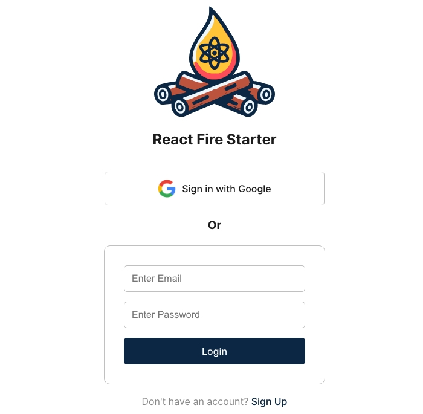

# React Fire Starter

**React Fire Starter** is a powerful boilerplate project designed to help you quickly start a modern web application with **React**, **Firebase**, **Vite**, **TypeScript**, **Recoil**, and **React Router DOM**. This template includes a pre-built login system, public pages, and private pages infrastructure, making it an ideal starting point for your next project.

## Features

- **Authentication with Firebase**: Secure and reliable user authentication.
- **Public and Private Routes**: Easily manage accessible routes based on user authentication state.
- **State Management with Recoil**: Simple and efficient state management.
- **Modern Build Setup with Vite and TypeScript**: Fast and optimized development experience.
- **Cookie Consent Management**: Manage user consent for cookies.

[Live Demo](https://main--react-fire-starter.netlify.app/)

## Installation

1. **Fork the Repository**:

   - Click the "Use this template" button on GitHub to create your own copy.

2. **Clone Your Forked Repository**:

   ```bash
   git clone https://github.com/yourusername/react-fire-starter.git
   cd react-fire-starter
   ```

3. **Install dependencies**:

```bash
npm install
```

4. **Set up a Firebase project**:

   - Go to the [Firebase Console](https://console.firebase.google.com/).
   - Create a new project.
   - Go to the project settings.
   - Add a web app to the project.
   - Copy the Firebase config object.

5. **Configure environment variables**:

   - Create a `.env` file in the root directory of the project.
   - Add the Firebase config object to the `.env` file:
     ```env
     VITE_FIREBASE_API_KEY=your-api-key
     VITE_FIREBASE_AUTH_DOMAIN=your-auth-domain
     VITE_FIREBASE_PROJECT_ID=your-project-id
     VITE_FIREBASE_STORAGE_BUCKET=your-storage-bucket
     VITE_FIREBASE_MESSAGING_SENDER_ID=your-messaging-sender-id
     VITE_FIREBASE_APP_ID=your-app-id
     ```

6. **Run the development server**:

```bash
npm run dev
```

## Customization

### Change Logo

- Replace the `public/ReactFireStarterLogo.svg` file with your own SVG logo.

### Update Login Page

- Update the `src/pages/Login.tsx` file to customize the login page.

### Update Landing Page

- Update the `src/pages/Landing.tsx` file to customize the landing page.

### Add a Private Page (Authenticated)

- Create a new file in the `src/pages` directory.
- Add a new route in the `src/App.tsx` file.
- Add the new route to the `privateRoutes` config.

### Add a Public Page (Unauthenticated)

- Create a new file in the `src/pages` directory.
- Add a new route in the `src/App.tsx` file.
- Add the new route to the `publicRoutes` config.

## Styling

This template does not take an opinionated stance on styling and tries to keep styles to a minimum, as the expectation is that each developer will want to take on that part themselves. Vite provides built-in support for `.scss`, `.sass`, `.less`, `.styl` and `.stylus` files. There are a couple of things you can do “out of the box”:

- Convert All CSS Files to SCSS, SASS, LESS, STYL, STYLUS: Simply rename your .css files to .scss and use the SCSS syntax. Vite will handle that automatically.
- Use Modular CSS or SCSS: You can use CSS Modules with either CSS or SCSS. Just follow the naming convention _.module.css or _.module.scss.

For more information on supported pre-processors and configuration, please refer to the [Vite documentation](https://vitejs.dev/guide/features.html#css).

## Import Aliases

To simplify imports, you can use the `'#/'` alias for the `'./src/'` directory. This means you don't have to worry about relative paths when importing modules from anywhere in the project.

**Example Usage:**

Instead of writing:

```javascript
import { MyComponent } from "../../components/MyComponent";
```

You can write:

```javascript
import { MyComponent } from "#/components/MyComponent";
```

This alias is configured in the `vite.config.ts` file and should work out of the box.

## Cookie Consent Management

This template includes a simple cookie consent management system that allows users to accept or decline cookies. The cookie consent banner is displayed at the bottom of the page and is managed by the `CookieBanner` component. The `CookieBanner` component uses the `useCookieConsentContext` hook to manage the user's consent state.

** Example Usage: **

```javascript
import { useCookieConsentContext } from "#/context/cookieConsentContext";

const { consent } = useCookieConsentContext();

if (consent.firstParty ) // Persist user data
if (consent.thirdParty ) // Record sign-in event
```

## Screenshots



## Opinionated Decisions

In this project, I have made several opinionated decisions to ensure consistency and align with best practices in the React ecosystem:

1. **Named Exports**:

- I try to keep all exports as named exports for consistency. Named exports provide clarity and help in avoiding default export pitfalls, such as incorrect import names.

2. **File Naming Conventions**:

- I have followed the directives of the creator of React and named all TypeScript files with the `.tsx` extension, even if they do not contain any JSX. This approach ensures consistency and allows for the possibility of adding JSX in the future without needing to rename files. For more details on this opinion, see [my favorite Github issue comment](https://github.com/airbnb/javascript/pull/985#issuecomment-239145468) by the creator of React [Dan Abramov](https://www.google.com/search?q=dan+abramov).

3. **Recoil State Management**:

- I have chosen Recoil for state management due to its simplicity and ease of use. Recoil is a state management library for React that provides several benefits, such as minimal boilerplate, global state management, and asynchronous data fetching. Recoil is a great choice for small to medium-sized projects and is easy to integrate with existing React applications.
- For more information on Recoil, please refer to the [official documentation](https://recoiljs.org/).
- For a practical guide on using Recoil, check out this [Recoil tutorial](https://recoiljs.org/docs/basic-tutorial/intro/).
- Recoil API documentation: [here](https://recoiljs.org/docs/api-reference/core/RecoilRoot/).

4. **React Router DOM**:

- I have chosen React Router DOM for routing due to its flexibility and ease of use. React Router DOM is a declarative routing library for React that provides several benefits, such as nested routing, dynamic routing, and route-based code splitting. React Router DOM is a great choice for single-page applications and is easy to integrate with existing React applications.
- For more information on React Router DOM, please refer to the [official documentation](https://reactrouter.com/).

5. **Firebase Authentication**:

- I have chosen Firebase for authentication, again, due to its simplicity and ease of use. Firebase is a platform developed by Google that provides several services, such as authentication, real-time database, cloud storage, and cloud functions. Firebase authentication is a great choice for small to medium-sized projects and is easy to integrate with existing React applications.
- For more information on Firebase authentication, please refer to the [official documentation](https://firebase.google.com/docs/auth).

The goal of these opinionated decisions is to provide a consistent and reliable development experience for developers. By following these best practices, you can ensure that your codebase is maintainable, scalable, and easy to understand. The only of these opinions that would be inefficient to modify is the use of `react-router-dom` and Firebase authentication, but the rest can easily be changed.

## Contributing

Contributions are welcome! Please open an issue or submit a pull request for any improvements.

## License

This project is open source and available under the [MIT License](LICENSE).

## Keywords

react, firebase, vite, typescript, recoil, boilerplate, authentication, template, web app, starter kit, react-router, react-router-dom, firebase-auth, firebase-authentication, vitejs, frontend, web development, spa, single page application, react-hooks, typescript-react, vite-template, react-template, firebase-template, react-firebase, vite-react, recoil-state, state management, login, signup, user registration, private routes, public routes, protected routes, user authentication, project setup, dev tools, modern web development, react boilerplate, vite boilerplate, firebase boilerplate, starter template, developer tools, codebase, best practices, scalable architecture, project template, react project, web starter, client-side, react ecosystem, frontend tooling, react-vite, react starter, authentication system, fullstack, reactjs, frontend template, project boilerplate, react auth, firebase login, react recoil, react spa, typescript starter, typescript boilerplate, vitejs starter, vitejs boilerplate, firebase project, authentication template, modern js, jsx, tsx, jsx react, typescript react template, cookie, consent, cookie consent, cookie management, cookie banner
